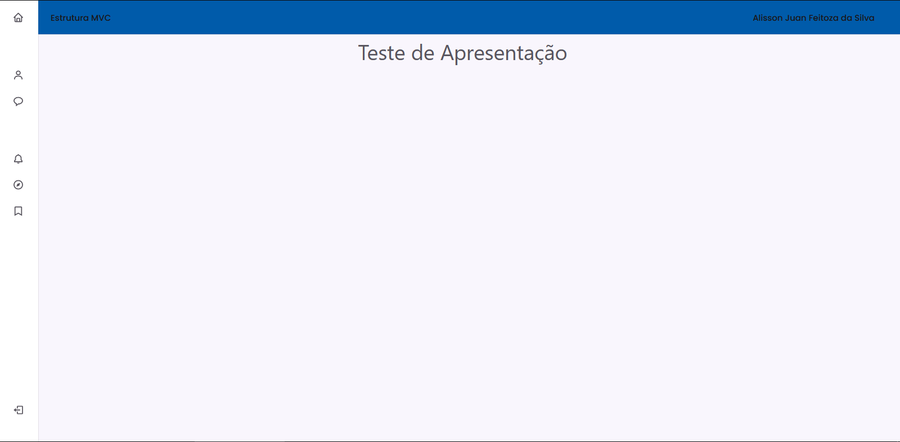

# Projeto Estrutura MVC

Aqui estão alocados todos os arquivos e scripts necessários para a formação de uma estrutura MVC!

## Método de Uso

* Fazer o download dos arquivos

* Nos arquivos "config.php" e "public/js/libs.js" mudar trajetória para o caminho desejado. Por exemplo: "http://localhost/estagio/MVC/"